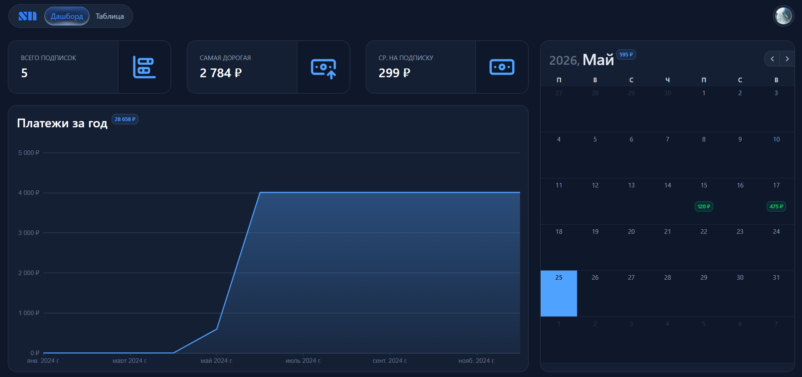

# 💳 SubTrack — Subscription Management Dashboard

**SubTrack** — это веб-приложение для отслеживания подписок и регулярных платежей. Приложение помогает контролировать расходы, отслеживать активные подписки и получать уведомления перед списанием средств.

## 🌟 Особенности

- **📊 Дашборд** — обзор основных метрик и ежемесячных расходов
- **📈 Графики аналитики** — визуализация расходов по месяцам и суммарный расход на год
- **📋 Таблица подписок** — удобное управление активными сервисами
- **🔔 Уведомления об оплате** — email-напоминания перед списанием средств
- **🎨 Настройка интерфейса** — выбор темы, языка и валюты
- **📱 Адаптивный интерфейс** — поддержка мобильных устройств и десктопов

## 🚀 Технологический стек

**Фронтенд:**

- Nuxt + TypeScript
- TailwindCSS + Nuxt UI
- Apache ECharts

**Бэкенд/Сервисы:**

- Supabase (Auth, Database, Edge Functions, Storage)
- Resend (email-уведомления)

## 🖼️ Основной интерфейс

